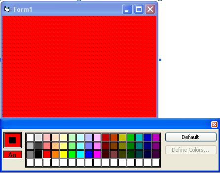



## VB MANIFEST HELP \( COLOR PALETTE \)

### Description

FOUND OUT HOW TO FIX THE COLOR PALETTE IN THE MANIFEST FILE.
 
### More Info
 

             |
---                |---
**Submitted On**   |
**By**             |[Jrobi7114](https://github.com/Planet-Source-Code/PSCIndex/blob/master/ByAuthor/jrobi7114.md)
**Level**          |Intermediate
**User Rating**    |3.7 (11 globes from 3 users)
**Compatibility**  |VB 3\.0, VB 4\.0 \(16\-bit\), VB 4\.0 \(32\-bit\), VB 5\.0, VB 6\.0
**Category**       |[Coding Standards](https://github.com/Planet-Source-Code/PSCIndex/blob/master/ByCategory/coding-standards__1-43.md)
**World**          |[Visual Basic](https://github.com/Planet-Source-Code/PSCIndex/blob/master/ByWorld/visual-basic.md)
**Archive File**   |

### Source Code

Ok Go To View Click Color Palette And Then Click Background Of the form to select the file you want to edit, then you see the color palette click the gray box with the black squareand then click a color.

